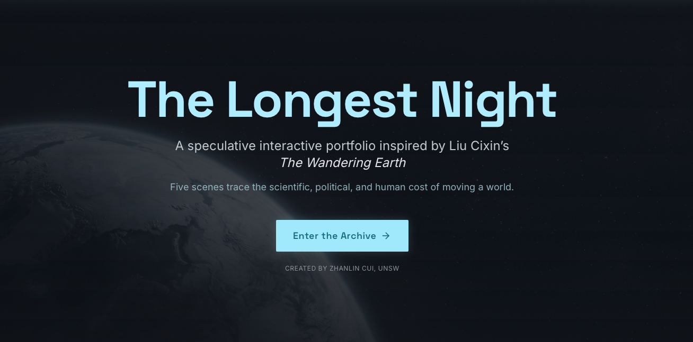

<p align="center">
  
</p>

<h1 align="center">The Longest Night</h1>

<p align="center">
  <strong>An interactive speculative narrative portfolio inspired by Liu Cixin's <em>The Wandering Earth</em>.</strong>
</p>

<p align="center">
  A cinematic web experience that turns planetary engineering, public trust, survival design, and deep time into five sequential visual scenes.
</p>

<p align="center">
  
  
  
  
</p>

---

## Overview

**The Longest Night** is a browser-based creative portfolio built for **GENS4015** by **Zhanlin Cui, UNSW**. It reframes *The Wandering Earth* as an interactive archive: not a summary of the story, but a designed journey through the scientific, ethical, and emotional pressures behind moving a planet.

The project combines cinematic AI-generated visuals, concise narrative copy, hard science references, and progressive scene unlocking. Each scene presents five visual fragments. The viewer advances through the sequence, completes the scene, and unlocks the next stage of Earth's escape.

The result is part digital exhibition, part speculative interface, and part science-fiction interpretation.

---

## Why It Is Different

Most adaptations of *The Wandering Earth* focus on spectacle. This project treats spectacle as an interface problem.

It asks:

- How can planetary-scale physics be translated into readable interaction?
- How can a science-fiction narrative become an academic visual system?
- How can a user move through engineering decisions, ecological fragility, orbital risk, social trust, and generational memory without reading a long essay?

The innovation is the format: a **sequential visual archive** where each image is both a cinematic moment and a conceptual decision point.

---

## Narrative Structure

| Scene | Theme | Interactive Focus | Novel Connection |
| --- | --- | --- | --- |
| **I. Stop the Sky** | Rotational control | Thrust angle, torque, scale, and the move underground | Earth's engines begin braking planetary rotation. |
| **II. Build a Small World** | Closed-loop ecology | Underground survival, biospheres, extreme environments, and system failure | Humanity learns that shelter is not the same as habitability. |
| **III. Borrow a Giant** | Jupiter trajectory | Gravity assist, tidal danger, and escape velocity | Earth risks destruction near Jupiter to gain the speed needed to escape. |
| **IV. Read the Sun** | Evidence and public trust | Solar uncertainty, rebellion, scientific proof, and social fracture | The delayed truth of the helium flash exposes the cost of disbelief. |
| **V. Count the Generations** | Deep time continuity | Frozen atmosphere, interstellar drift, inherited memory, and distant hope | The journey becomes larger than any single lifetime. |

Each scene contains five authored frames. The user moves forward frame by frame, turning the story into a paced visual ritual rather than a passive slideshow.

---

## Experience Highlights

- **Cinematic scene progression**: 25 image-led narrative beats across five themed chapters.
- **Unlock-based structure**: scenes open sequentially, reinforcing the sense of a journey through time and risk.
- **Science-fiction interface language**: restrained typography, dark surfaces, luminous accents, and archive-like composition.
- **Novel-aware storytelling**: each chapter maps back to a core scientific or dramatic pressure in *The Wandering Earth*.
- **Academic but accessible**: scientific concepts are present, but the user experiences them through atmosphere, pacing, and interaction.
- **Commercial-grade presentation**: designed as a polished creative portfolio, not a raw coursework prototype.

---

## Design Direction

The visual system is built around a speculative archive aesthetic:

- charcoal surfaces and low-contrast industrial depth
- cool cyan light for scientific systems and propulsion
- restrained amber highlights for memory, warning, and hope
- large 16:9 cinematic images with negative space for text panels
- minimal controls that keep attention on the narrative sequence

Typography uses **Space Grotesk** for headings and interface labels, paired with **Inter** for readable body copy.

---

## Technical Stack

| Layer | Choice |
| --- | --- |
| Frontend | React 19 |
| Build tool | Vite |
| Language | TypeScript |
| Styling | Tailwind CSS |
| Routing | React Router |
| State | React context and localStorage |
| Media | Static assets served from `web/public/media` |

Progress is stored locally in the browser. Completing each scene updates the local archive state and unlocks the next scene.

---

## Project Structure

```text
.
├── docs/
│   ├── README.md
│   └── 图片素材.md
├── reference/
│   └── stitch/
├── web/
│   ├── public/media/
│   │   ├── landingpage.png
│   │   ├── Scene1/
│   │   ├── Scene2/
│   │   ├── Scene3/
│   │   ├── Scene4/
│   │   └── Scene5/
│   └── src/
│       ├── components/
│       ├── context/
│       ├── data/
│       └── pages/
└── README.md
```

---

## Run Locally

```bash
cd web
npm install
npm run dev
```

Open the local URL printed by Vite.

Build for production:

```bash
cd web
npm run build
```

---

## Core Flow

1. The viewer enters the archive from the landing page.
2. The archive hub reveals the available scene node.
3. A scene opens with its first cinematic frame and narrative text.
4. The viewer clicks **Continue** through all five frames.
5. Completing the fifth frame unlocks the next scene.
6. Completing all five scenes unlocks the final reflection.

This structure gives the work a clear rhythm: observe, interpret, continue, unlock.

---

## Creative Positioning

**The Longest Night** is designed as a premium interactive story object: a way to present literary analysis, speculative design, and frontend craft in one coherent experience.

It does not try to reproduce the novel directly. Instead, it extracts five pressures from the source material and gives each one a focused visual interface:

- force against a planet
- life inside a closed system
- risk inside orbital mechanics
- truth under political pressure
- memory across generations

That is the central design argument of the project: survival is not one decision. It is a chain of systems that must keep meaning alive long after the original crisis begins.

---

## Credits

Created by **Zhanlin Cui, UNSW** for **GENS4015**.

Inspired by Liu Cixin's *The Wandering Earth*.
